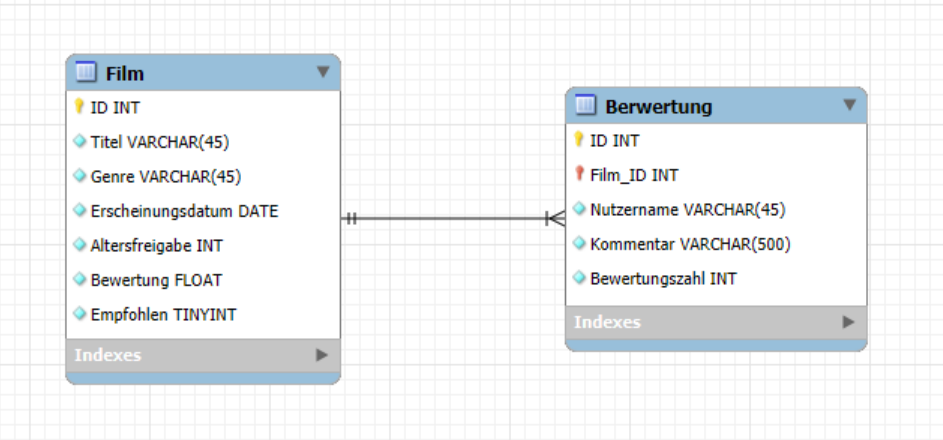
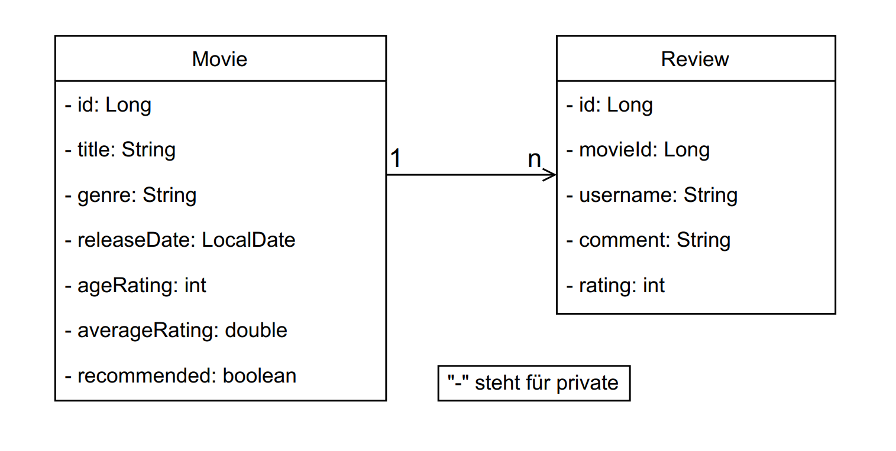
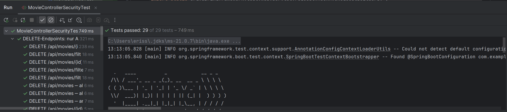
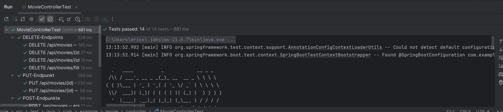
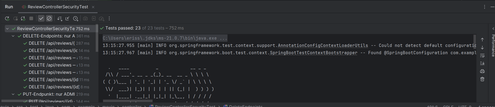
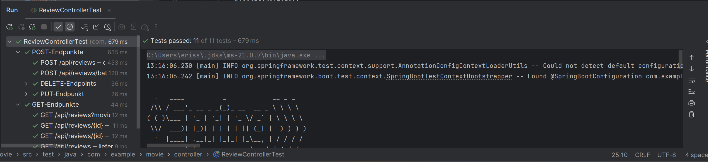
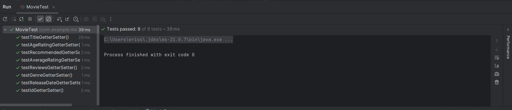
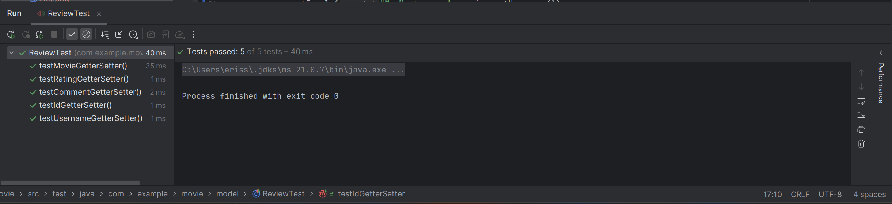
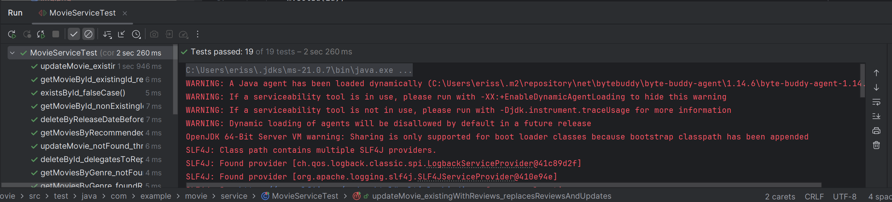
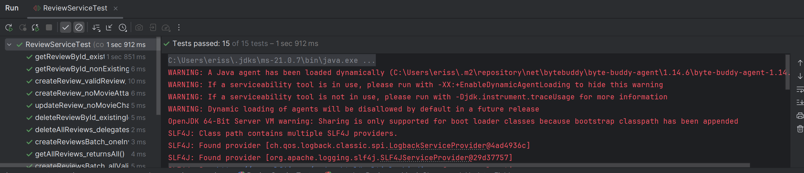

# Movie

## Beschreibung
Eine Spring-Boot-REST-API zum Verwalten von Filmen und deren zugehörigen Reviews.  
Filme (“Movie”-Entität) haben Attribute wie Titel, Genre, Veröffentlichungsdatum, Altersfreigabe, durchschnittliche Bewertung, ein Boolean-Flag „recommended“ und eine Liste von Reviews.  
Reviews (“Review”-Entität) referenzieren jeweils genau einen Film. Die API stellt CRUD-Endpunkte für beide Entitäten bereit, inklusive Filtermöglichkeiten (z. B. nach empfohlener Flag oder Genre für Filme, nach Movie-ID für Reviews).

---

## Visuals
> **Datenbankdiagramm**  
> **
>
> **Klassendiagramm**  
> **
>
> **Screenshot der Testdurchführung**  
> **
>
> **
> 
> **
> 
> **
> 
> **
> 
> **
> 
> **
> 
> **

---

## Validierungsregeln
- **Movie**
    - `title`: Länge zwischen 2 und 100 Zeichen (`@Size(min = 2, max = 100)`)
    - `releaseDate`: Darf nicht in der Zukunft liegen (`@PastOrPresent`)
    - `ageRating`: Muss ≥ 0 sein (`@Min(0)`)
    - Alle anderen Felder (genre, averageRating, recommended, reviews) werden serverseitig akzeptiert.
- **Review**
    - Keine speziellen Validierungen außer Pflichtfelder im JSON, z. B.:
        - `username` darf nicht leer sein (implizit über Entitätspflicht).
        - `rating` (int) sollte eine Zahl sein; Geschäftslogik in Service prüft nicht weiter.

---

## Berechtigungsmatrix

| Endpunkt                                      | HTTP-Methode | Rollen erlaubt           | Erklärung                                                              |
|-----------------------------------------------|--------------|--------------------------|-------------------------------------------------------------------------|
| `/api/movies`                                 | GET          | ADMIN, USER              | Alle Filme abrufen                                                      |
| `/api/movies/{id}`                            | GET          | ADMIN, USER              | Einzelnen Film abrufen                                                  |
| `/api/movies/exists/{id}`                     | GET          | ADMIN, USER              | Existenzprüfung Film-ID                                                 |
| `/api/movies/filter/recommended?recommended=` | GET          | ADMIN, USER              | Alle Filme nach `recommended` flag filtern                               |
| `/api/movies/filter/genre?genre=`             | GET          | ADMIN, USER              | Alle Filme nach Genre filtern                                            |
| `/api/movies`                                 | POST         | ADMIN                    | Neuen Film erstellen                                                     |
| `/api/movies/batch`                           | POST         | ADMIN                    | Mehrere neue Filme auf einmal erstellen                                  |
| `/api/movies/{id}`                            | PUT          | ADMIN                    | Film mit bestimmter ID aktualisieren                                      |
| `/api/movies/{id}`                            | DELETE       | ADMIN                    | Film mit bestimmter ID löschen                                            |
| `/api/movies/filter/releaseDate?date=`        | DELETE       | ADMIN                    | Alle Filme vor einem bestimmten Datum löschen                              |
| `/api/movies`                                 | DELETE       | ADMIN                    | Alle Filme löschen                                                        |
| `/api/reviews`                                | GET          | ADMIN, USER              | Alle Reviews (oder optional gefiltert nach `movieId`) abrufen             |
| `/api/reviews/{id}`                           | GET          | ADMIN, USER              | Einzelne Review abrufen                                                    |
| `/api/reviews`                                | POST         | ADMIN                    | Neue Review erstellen                                                       |
| `/api/reviews/batch`                          | POST         | ADMIN                    | Mehrere Reviews auf einmal erstellen                                        |
| `/api/reviews/{id}`                           | PUT          | ADMIN                    | Review mit bestimmter ID aktualisieren                                       |
| `/api/reviews/{id}`                           | DELETE       | ADMIN                    | Review mit bestimmter ID löschen                                             |
| `/api/reviews`                                | DELETE       | ADMIN                    | Alle Reviews löschen                                                          |

**Login für Tests:**
- **ADMIN**-User:
    - Benutzername: `admin`
    - Passwort: `admin`
- **USER**-User:
    - Benutzername: `user`
    - Passwort: `user`

---

## OpenAPI-Dokumentation der Services (Ressourcen)

[api-docs.yaml](../../../Users/eriss/Downloads/api-docs.yaml)

Die Swagger-UI ist verfügbar unter:  
http://localhost:8080/swagger-ui/index.html

(Alternativ: `http://localhost:8080/swagger-ui.html`)

---

## Autor
Eris Salihu

---

## Zusammenfassung
Die „Movie“-API bietet eine vollständige CRUD-Funktionalität für Filme und deren Reviews.
- Filme können validiert, gefiltert (nach Empfehlung oder Genre) und batchweise erstellt werden.
- Reviews können zu einem Film hinzugefügt, gefiltert, aktualisiert und gelöscht werden.
- Spring Security schützt sensible Endpunkte so, dass nur angemeldete `ADMIN`- oder `USER`-Rollen lesenden Zugriff haben und nur `ADMIN`-Rollen schreibende bzw. löschende Aktionen ausführen dürfen.
- Alle Services sind in OpenAPI dokumentiert und via Swagger-UI testbar.
